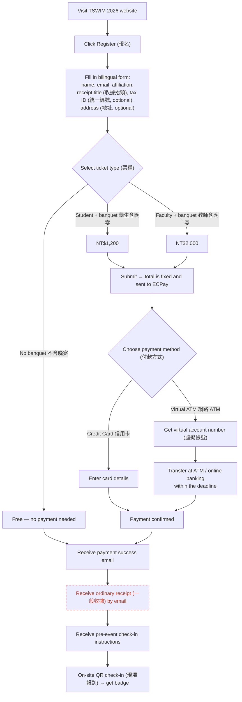
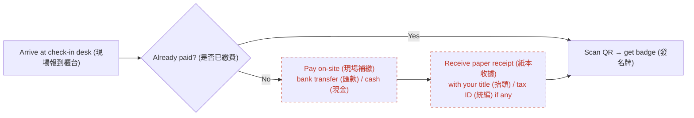
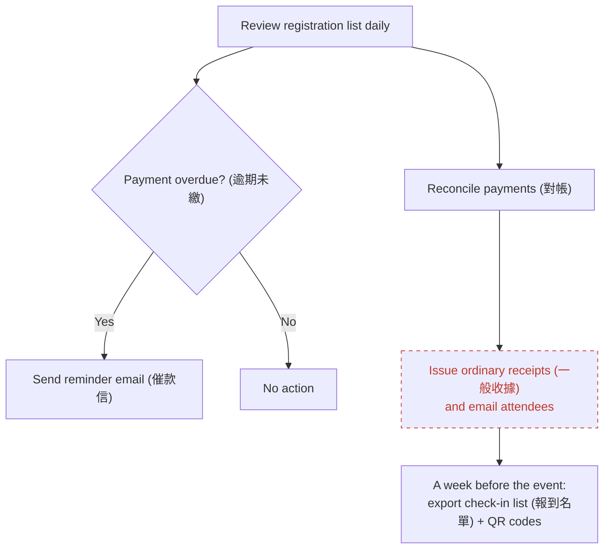
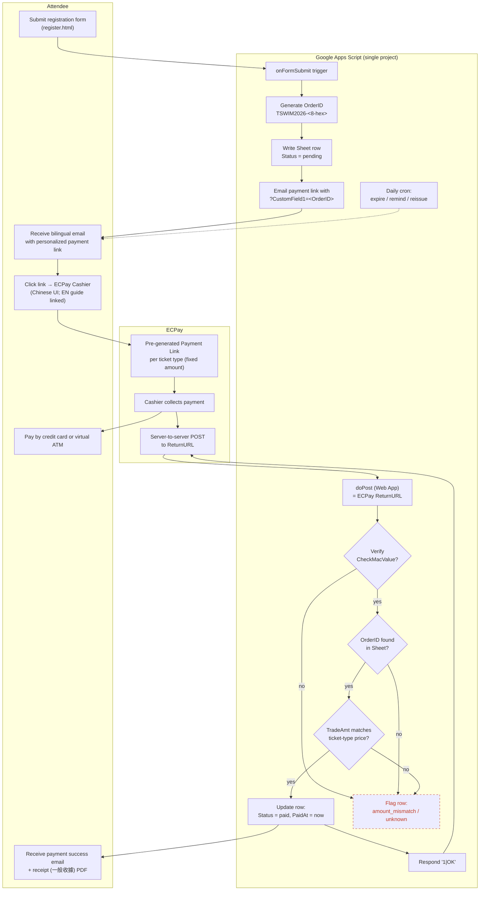

## User Journey Map

> **Legend**: nodes with a dashed red border are steps whose design is still **pending discussion** and may change before launch.
>
> Two plans are on the table. Attendee-facing flows are nearly identical; the internal / organizer flows differ. Sections below cover:
>
> 1. Main flow (attendee) — shared by both plans
> 2. On-site fallback — shared by both plans
> 3. Organizer back-office — Plan B (full AIO integration, `PLAN.payment-ecpay.md`)
> 4. **Plan A variant** — Apps Script + ECPay Payment Link (`PLAN.payment-appsscript.md`): internal flow and per-attendee binding

### Main flow — online registration & payment

**Still pending discussion:**

- `K` — when the receipt arrives (shortly after payment, or after the event) and exactly what the receipt looks like.

### Fallback — on-site late payment

**Still pending discussion:**

- `D` — which on-site payment methods are accepted.
- `E` — paper receipt template / who signs it.

### Organizer back-office view

**Still pending discussion:**

- `X` — whether receipts go out **right after each payment** or **as one batch after the event**.

### Plan A variant — Apps Script + ECPay Payment Link (internal flow)

> See `PLAN.payment-appsscript.md`. The attendee still experiences the Main flow above; this diagram shows what happens **inside the system** for Plan A, and how one specific attendee is identified across the payment round-trip.

**Key points:**

- **Binding**: `OrderID` is generated by Apps Script at form submit and passed to ECPay via `CustomField1`, which ECPay echoes back unchanged in the callback. This is the only reliable key — neither email, name, nor amount alone can identify the attendee.
- **Three defenses** against spoofed / tampered callbacks, all required: (1) `CheckMacValue` matches `HashKey` / `HashIV`; (2) `OrderID` exists in Sheet with `Status=pending`; (3) `TradeAmt` equals the server-side price for that ticket type. Any failure routes to `amount_mismatch` / `unknown` rather than `paid`.
- **Idempotency**: a valid callback for an already-`paid` row is a no-op; ECPay retries are safe.
- **No AIO signing code** — ECPay generates the payment link; we only verify the callback signature.

**Still pending discussion:**

- `B11` — exact operator workflow for anomalous callbacks (email alert vs. Sheet filter view).
- Receipt arrival (`A5`) timing — same open question as the shared back-office view: per-payment or post-event batch.
