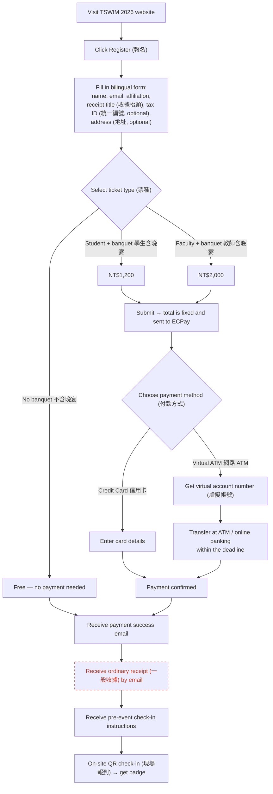
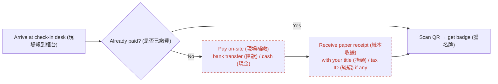
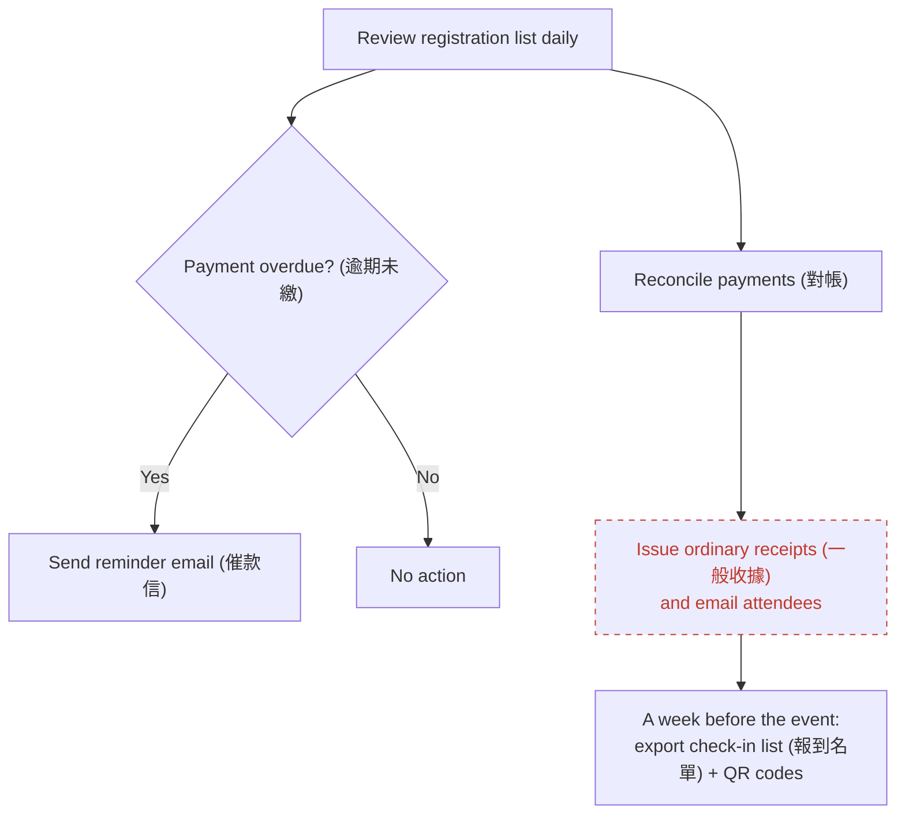

## User Journey Map

> **Legend**: nodes with a dashed red border are steps whose design is still **pending discussion** and may change before launch.

### Main flow — online registration & payment

**Still pending discussion:**

- `K` — when the receipt arrives (shortly after payment, or after the event) and exactly what the receipt looks like.

### Fallback — on-site late payment

**Still pending discussion:**

- `D` — which on-site payment methods are accepted.
- `E` — paper receipt template / who signs it.

### Organizer back-office view

**Still pending discussion:**

- `X` — whether receipts go out **right after each payment** or **as one batch after the event**.
